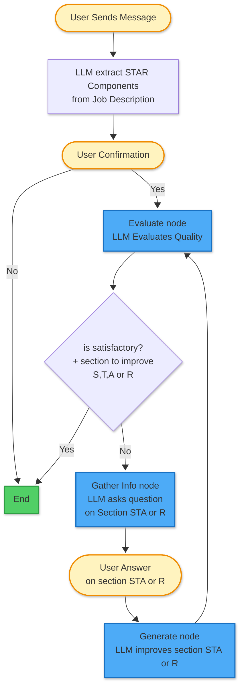

# Mission STAR chat
Chat to reformulate descriptions into STAR

### 1. Install requirements

Create environment with python 3.11 (for langfuse compatibility) and activate
```
python3 -m venv .venv
source .venv/bin/activate
``` 

Install requirements (for my set-up):
```
python3 -m pip install -r requirements.txt
```
If you need to re-create the environement from scratch: 
```
deactivate 2>/dev/null
rm -rf .venv
```
To update the requirements file : 
```
pip freeze > requirements.txt
```

## 2. Environment variables .env

in the `.env` file at the root of the project, you need to put the secrets:

```
# OpenAI
OPENAI_API_KEY=

# LangSmith
LANGSMITH_TRACING=true
LANGSMITH_API_KEY=

# App parameters
MODEL_NAME=gpt-4.1-mini
TEMP_QUESTIONS=0.1
TEMP_EVALUATION=0.1
TEMP_GENERATION=0.01
TEMP_EXTRACTION=0.01
VERBOSE=True
MAX_QUESTIONS_PER_SECTION=4
MAX_TOTAL_QUESTIONS=12

# App Authentication
APP_USERNAME=
APP_PASSWORD=
CHAINLIT_AUTH_SECRET=
```

## 3. Langsmith

LangSmith is used for observability and prompt management. 
To test that the connection to Langsmith functions for prompt storage (with "test_prompt"): 

```
python3 src/prompt_manager.py
```

To push the prompts from `src/config_prompts.py` to Langsmith for version control, run:

```
python3 src/setup_prompts.py 
```
Prompts can be either edited locally or directly from LangSmith UI. 

## 4. Run chainlit app

```
chainlit run app.py -w
```


## 5. Langgraph workflow for the agentic chatbot

Below is a simplified version of the graph implemented with LangGraph in the code for the agent workflow. 



## 6. (Optional) Cloudflare tunnel for development 

For a quick (ephemeral) tunnel to expose the chainlit application on a public url, run:
```
chainlit run app.py --port 8000
cloudflared tunnel --url http://localhost:8000

```
The temporary url will be printed (like https://random-string.trycloudflare.com).


## 7. Deploy with Render + authentification

On https://dashboard.render.com/, to create the web service. This is currently based on the branch 'dev' in Github repo.

To access the application : https://mission-star-chat.onrender.com 

To authenticate, enter the username and password provided separately.

